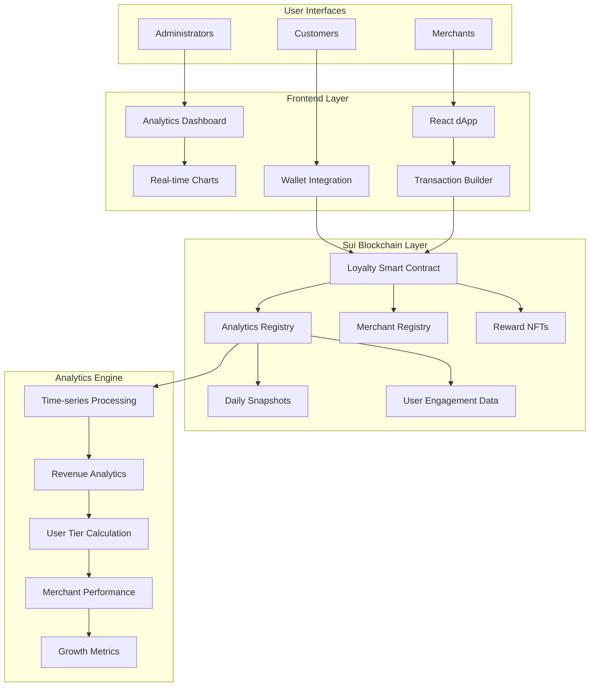

# 🎯 SuiLoyal - Decentralized Loyalty Platform

[](https://sui.io)
[](https://github.com/MystenLabs/sui/tree/main/sui-move)
[](https://www.typescriptlang.org/)
[](https://reactjs.org/)
[](LICENSE)

> A comprehensive cross-merchant loyalty platform built on Sui blockchain featuring real-time analytics, merchant insights, and customer engagement tracking. Businesses issue verifiable loyalty points that customers truly own, while gaining access to powerful analytics dashboards and cross-platform redemption capabilities.


## 🌟 Live Demo

- **Devnet Deployment**: [sui-loyal.vercel.app](https://sui-loyal.vercel.app)
- **Video Walkthrough**: [Watch Demo](demo/demo.mp4)
- **Package Explorer**: [View on Sui Explorer](https://suiexplorer.com/object/0xa6e8c67e94418debfb4bf3291d41b6b7293d9e8307859db2dab3e018c6eeff4a?network=devnet)

## ✨ Key Features

### For Customers
- 🔐 **True Ownership**: Loyalty points stored in your Sui wallet
- 🔄 **Cross-Merchant Rewards**: Use points across all participating merchants
- 🎁 **NFT Vouchers**: Redeem points for exclusive NFT rewards
- 💸 **P2P Transfers**: Send points to friends and family
- 📊 **Transparent History**: All transactions on-chain and verifiable
- 🏆 **User Tiers**: Bronze, Silver, Gold, and Platinum tier progression
- ⚡ **Real-time Updates**: Live transaction notifications and balance updates

### For Merchants
- 🏪 **Easy Integration**: Simple SDK for POS/payment systems
- 📈 **Comprehensive Analytics**: Real-time dashboards with transaction insights
- 📊 **Customer Intelligence**: User engagement tracking and tier analytics
- 💰 **Revenue Analytics**: Detailed revenue breakdown and growth tracking
- 📅 **Time-series Data**: Daily, weekly, and monthly performance metrics
- 🎯 **Merchant Performance**: Cross-platform comparison and benchmarking
- 🛡️ **Fraud Prevention**: Blockchain-secured point issuance
- 🤝 **Partnership Network**: Create cross-merchant promotions
- 💰 **Cost Effective**: Lower fees than traditional loyalty programs

### For Platform Administrators
- 🔍 **Platform-wide Analytics**: Comprehensive system performance monitoring
- 📈 **Growth Metrics**: User acquisition, retention, and engagement tracking
- 💼 **Merchant Management**: Onboarding, performance monitoring, and support
- 🏆 **Milestone Tracking**: Automated achievement and growth milestone detection
- 📊 **Revenue Intelligence**: Multi-dimensional revenue analysis and projections

## 🏗️ Architecture



## 🚀 Quick Start

### Prerequisites
- [Sui CLI](https://docs.sui.io/build/install) (latest version)
- [Node.js](https://nodejs.org/) (v18+)
- [pnpm](https://pnpm.io/) or npm

### 1. Clone the Repository
```bash
git clone https://github.com/yourusername/sui-loyal.git
cd sui-loyal
```

### 2. Deploy Smart Contracts
```bash
# Navigate to Move package
cd sui-packages/Loyalty

# Build the package
sui move build

# Run tests
sui move test

# Deploy to devnet
sui client publish --gas-budget 100000000

# Save the package ID and platform object ID from output
```

### 3. Setup Frontend
```bash
# Navigate to frontend
cd ../../frontend

# Install dependencies
npm install

# Copy environment template
cp .env.example .env

# Update contract addresses in .env with your deployed addresses
# VITE_PACKAGE_ID=0x...
# VITE_PLATFORM_ID=0x...

# Start development server
npm run dev
```

### 4. Connect Wallet & Test
1. Install [Sui Wallet](https://chrome.google.com/webstore/detail/sui-wallet/opcgpfmipidbgpenhmajoajpbobppdil) or [Suiet](https://suiet.app/)
2. Switch to Devnet network
3. Get test SUI from [faucet](https://discord.com/invite/sui)
4. Connect wallet in the app
5. Create loyalty account
6. Use merchant portal to issue demo points
7. Redeem rewards from marketplace

## 📁 Project Structure

```
sui-loyal/
├── 📄 README.md
├── 📄 LICENSE
├── 📦 sui-packages/
│   └── Loyalty/
│       ├── Move.toml
│       ├── Move.lock
│       ├── sources/
│       │   ├── Loyalty.move           # Enhanced core loyalty logic
│       │   ├── Analytics.move         # Comprehensive analytics module
│       │   └── tests/
│       │       └── loyalty_tests.move # Comprehensive tests
│       └── build/
├── 💻 frontend/
│   ├── package.json
│   ├── .env.example                   # Environment template
│   ├── src/
│   │   ├── App.tsx                    # Main application
│   │   ├── config.ts                  # Configuration & env vars
│   │   ├── types/
│   │   │   └── index.ts               # Enhanced TypeScript definitions
│   │   ├── components/                # Reusable UI components
│   │   │   ├── Navigation.tsx
│   │   │   ├── Notification.tsx
│   │   │   ├── LoadingOverlay.tsx
│   │   │   ├── SkeletonLoader.tsx     # Loading state component
│   │   │   ├── StatCard.tsx           # Analytics stat card
│   │   │   ├── Footer.tsx
│   │   │   ├── charts/                # Chart components
│   │   │   │   ├── AreaChart.tsx
│   │   │   │   ├── BarChart.tsx
│   │   │   │   ├── LineChart.tsx
│   │   │   │   └── PieChart.tsx
│   │   │   └── tabs/                  # Tab components
│   │   │       ├── HomeTab.tsx
│   │   │       ├── RewardsTab.tsx
│   │   │       ├── MerchantTab.tsx
│   │   │       ├── AnalyticsTab.tsx   # Comprehensive analytics dashboard
│   │   │       └── ProfileTab.tsx
│   │   └── lib/
│   │       ├── sui.ts                 # Sui SDK wrapper
│   │       └── analyticsService.ts    # Enhanced analytics service
├── 📁 scripts/
│   └── deploy.sh                      # Deployment script
├── 📁 docs/                          # Documentation
│   ├── architecture.md
│   ├── move_contract_docs.md
│   ├── analytics_guide.md             # Analytics documentation
│   └── onboarding_guide.md
├── ⚙️  .github/
│   └── workflows/
│       └── ci.yml                     # CI/CD pipeline
└── 🔧 Configuration files
    ├── .gitignore
    ├── LICENSE
    └── README.md
```

## 🛠️ Development

### Frontend Development
```bash
cd frontend

# Install dependencies
npm install

# Start development server
npm run dev

# Run tests
npm run test

# Build for production
npm run build

# Lint code
npm run lint
```

### Smart Contract Development
```bash
cd sui-packages/Loyalty

# Build contracts
sui move build

# Run tests
sui move test

# Deploy to devnet
sui client publish --gas-budget 100000000
```

## 🧪 Testing

### Smart Contract Tests
The Move package includes comprehensive tests covering:
- Merchant registration and management
- Customer loyalty account creation
- Points issuance and redemption
- Cross-merchant transfers
- Reward template creation and redemption
- Platform statistics tracking
- Analytics registry initialization
- Daily snapshot creation and management
- User engagement tracking
- Revenue analytics recording
- Time-series data processing
- Merchant performance analytics
- User tier calculation and upgrades

```bash
cd sui-packages/Loyalty
sui move test --coverage
```

### Frontend Tests
```bash
cd frontend
npm run test
```

## 📊 Features Status

### Core Platform
- ✅ **Smart Contracts**: Fully implemented and tested
- ✅ **Frontend**: Complete UI with responsive design
- ✅ **Wallet Integration**: Ready for Sui Wallet connection
- ✅ **Demo Mode**: Working prototype with mock data
- ✅ **Live Deployment**: Deployed to devnet
- ✅ **Real Wallet Integration**: Prepared for @mysten/dapp-kit
- ✅ **NFT Rewards**: Framework ready for implementation

### Analytics & Intelligence
- ✅ **Analytics Dashboard**: Comprehensive real-time analytics
- ✅ **Smart Contract Analytics**: On-chain analytics registry
- ✅ **Time-series Data**: Daily, weekly, monthly metrics
- ✅ **User Engagement Tracking**: Session and tier analytics
- ✅ **Revenue Intelligence**: Multi-dimensional revenue analysis
- ✅ **Merchant Performance**: Cross-platform comparison
- ✅ **Growth Metrics**: User acquisition and retention tracking
- ✅ **Interactive Charts**: Beautiful data visualizations
- ✅ **Real-time Updates**: Live data refresh capabilities
- ✅ **Mock Data Fallback**: Development-friendly analytics

### Advanced Features
- ✅ **User Tier System**: Bronze, Silver, Gold, Platinum progression
- ✅ **Enhanced Events**: Metadata-rich blockchain events
- ✅ **Session Tracking**: User behavior analytics
- ✅ **Milestone Detection**: Automated achievement tracking
- ✅ **Professional Git Workflow**: Feature branches, semantic commits

## 📊 Analytics & Intelligence Platform

SuiLoyal includes a comprehensive analytics engine that provides real-time insights for merchants, platform administrators, and users.

### Analytics Features

#### 📈 Real-time Analytics Dashboard
- **Interactive Charts**: Beautiful data visualizations using Recharts
- **Time-series Analysis**: Daily, weekly, and monthly performance metrics
- **Live Data Updates**: Real-time refresh every 30 seconds
- **Responsive Design**: Glass morphism UI with mobile-first approach

#### 🎯 Merchant Intelligence
- **Customer Analytics**: Total customers served, retention rates, tier distribution
- **Revenue Tracking**: Points issued/redeemed, revenue generation, growth metrics
- **Performance Benchmarking**: Cross-merchant comparison and ranking
- **Transaction Insights**: Average transaction size, frequency analysis
- **Top Rewards Analysis**: Most popular rewards, redemption patterns

#### 👥 User Engagement Tracking
- **Tier System**: Bronze, Silver, Gold, Platinum progression tracking
- **Session Analytics**: Duration, frequency, engagement scoring
- **Behavioral Patterns**: Favorite merchants, transaction preferences
- **Retention Metrics**: New vs returning users, lifecycle analysis

#### 💰 Revenue Intelligence
- **Multi-dimensional Analysis**: Merchant fees, transaction fees, premium features
- **Growth Projections**: Monthly revenue forecasting
- **Fee Structure Optimization**: Performance-based insights
- **Platform Economics**: Total value locked, circulation metrics

#### 📅 Time-series Data Processing
- **Daily Snapshots**: Comprehensive daily platform statistics
- **Historical Trends**: Long-term performance analysis
- **Seasonal Patterns**: Peak usage identification
- **Growth Milestones**: Automated milestone detection and celebration

### Smart Contract Analytics Architecture

#### Analytics Registry (`Analytics.move`)
- **Daily Snapshots**: Time-stamped performance data
- **Merchant Analytics**: Individual merchant performance tracking
- **User Engagement**: Session data and tier progression
- **Revenue Tracking**: Comprehensive fee and revenue analysis
- **Platform Metrics**: Overall system health and growth

#### Enhanced Events
- **Metadata-rich Events**: Transaction context and analytics data
- **User Journey Tracking**: Session start/end, tier upgrades
- **Revenue Events**: Fee collection, milestone achievements
- **Performance Events**: Merchant snapshots, user engagement updates

### Data Visualization Components

#### Chart Types Available
- **Area Charts**: Transaction volume trends
- **Line Charts**: Growth and performance trends  
- **Pie Charts**: Revenue breakdown analysis
- **Bar Charts**: Comparative merchant performance
- **Stat Cards**: Key performance indicators with trend indicators

#### Interactive Features
- **Period Selection**: Switch between daily/weekly/monthly views
- **Real-time Updates**: Live data refresh with loading states
- **Hover Tooltips**: Detailed data points on interaction
- **Responsive Design**: Mobile and desktop optimized

## 🔧 Configuration

### Environment Variables
Copy `.env.example` to `.env` in the frontend directory:

```env
# Sui Network Configuration
VITE_SUI_NETWORK=devnet

# Contract Addresses (Update after deployment)
VITE_PACKAGE_ID=0xa6e8c67e94418debfb4bf3291d41b6b7293d9e8307859db2dab3e018c6eeff4a
VITE_PLATFORM_ID=0x_YOUR_PLATFORM_OBJECT_ID_HERE
VITE_ANALYTICS_REGISTRY_ID=0x_YOUR_ANALYTICS_REGISTRY_ID_HERE

# Analytics Configuration
VITE_ANALYTICS_REFRESH_INTERVAL=30000
VITE_ENABLE_MOCK_DATA=true
```

### Smart Contract Configuration
The platform now includes two main smart contract modules:

1. **Loyalty.move**: Core loyalty platform functionality
   - Merchant registration and management
   - User account creation and management
   - Points issuance and redemption
   - Reward template creation and redemption
   - Cross-merchant transfers

2. **Analytics.move**: Comprehensive analytics engine
   - Analytics registry initialization
   - Daily snapshot management
   - User engagement tracking
   - Revenue analytics recording
   - Merchant performance monitoring
   - Time-series data processing

## 🚀 Deployment

### Smart Contracts Deployment
1. Ensure you have a Sui wallet configured for devnet
2. Fund your wallet with test SUI tokens
3. Deploy the loyalty platform:

```bash
cd sui-packages/Loyalty
sui client publish --gas-budget 100000000
```

4. Save the deployed addresses:
   - **Package ID**: Main contract package identifier
   - **Platform ID**: LoyaltyPlatform shared object ID
   - **Analytics Registry ID**: AnalyticsRegistry shared object ID (if initialized)

5. Initialize analytics registry (optional):
```bash
sui client call --package $PACKAGE_ID --module analytics --function initialize_analytics --gas-budget 10000000
```

### Frontend Deployment
The frontend is ready for deployment on:
- **Vercel** (Recommended): Automatic deployments with GitHub integration
- **Netlify**: Easy static site hosting
- **GitHub Pages**: Free hosting for open source projects
- **AWS S3 + CloudFront**: Enterprise-grade hosting
- Any static hosting service

### Production Configuration
For production deployment:
1. Update environment variables with actual contract addresses
2. Configure analytics refresh intervals based on usage patterns
3. Set up monitoring for smart contract events
4. Enable error tracking and performance monitoring
5. Configure CDN for optimal global performance

## 🤝 Contributing

We welcome contributions to SuiLoyal! This project follows professional development practices:

### Development Workflow
1. Fork the repository
2. Create a feature branch (`git checkout -b feature/amazing-feature`)
3. Make your changes following the existing patterns
4. Write or update tests as needed
5. Commit your changes with semantic commit messages:
   ```bash
   git commit -m "feat: add user engagement analytics"
   git commit -m "fix: resolve chart rendering issue"
   git commit -m "docs: update analytics documentation"
   ```
6. Push to your feature branch (`git push origin feature/amazing-feature`)
7. Open a Pull Request with a detailed description

### Code Standards
- **TypeScript**: Use strict typing throughout the frontend
- **Move**: Follow Sui Move best practices for smart contracts
- **UI/UX**: Maintain glass morphism design consistency
- **Analytics**: Ensure all new features include proper analytics tracking
- **Testing**: Add comprehensive tests for new functionality

### Areas for Contribution
- 🔧 **Smart Contract Enhancements**: Additional analytics features, optimization
- 🎨 **UI/UX Improvements**: New chart types, mobile optimization
- 📊 **Analytics Features**: Advanced metrics, predictive analytics
- 🧪 **Testing**: Unit tests, integration tests, end-to-end tests
- 📚 **Documentation**: Guides, tutorials, API documentation
- 🌐 **Integrations**: Third-party analytics tools, notification systems

## 📝 License

This project is licensed under the MIT License - see the [LICENSE](LICENSE) file for details.

## 🔗 Links & Resources

### Blockchain & Smart Contracts
- [Sui Documentation](https://docs.sui.io/)
- [Move Language Guide](https://github.com/MystenLabs/sui/tree/main/sui-move)
- [Sui Explorer](https://suiexplorer.com/)
- [Sui Wallet](https://chrome.google.com/webstore/detail/sui-wallet/opcgpfmipidbgpenhmajoajpbobppdil)

### Frontend Technologies
- [React Documentation](https://react.dev/)
- [TypeScript Handbook](https://www.typescriptlang.org/docs/)
- [Tailwind CSS](https://tailwindcss.com/)
- [Recharts Library](https://recharts.org/)
- [Lucide Icons](https://lucide.dev/)

### Development Tools
- [Vite Build Tool](https://vitejs.dev/)
- [ESLint Configuration](https://eslint.org/)
- [Date-fns Library](https://date-fns.org/)

### Analytics & Data
- [Analytics Architecture Guide](docs/analytics_guide.md)
- [Chart Component Documentation](frontend/src/components/charts/)
- [Smart Contract Analytics](sui-packages/Loyalty/sources/Analytics.move)

## 📞 Support & Community

For questions, support, and community engagement:

### Getting Help
- 🐛 **Bug Reports**: Open an issue on GitHub with detailed reproduction steps
- 💡 **Feature Requests**: Use GitHub Discussions to propose new features
- 📚 **Documentation**: Check our comprehensive [documentation](docs/)
- 🏗️ **Architecture**: Review the [architecture guide](docs/architecture.md)
- 📊 **Analytics Guide**: Learn about analytics features in [analytics_guide.md](docs/analytics_guide.md)

### Development Support
- 🔧 **Smart Contract Issues**: Check Move.toml configuration and deployment logs
- 💻 **Frontend Issues**: Review browser console and network requests
- 📊 **Analytics Issues**: Verify contract addresses and network connectivity
- 🔄 **Deployment Issues**: Check Sui CLI version and wallet configuration

### Community Resources
- 💬 **Discussions**: GitHub Discussions for feature requests and ideas
- 📖 **Wiki**: Community-maintained documentation and guides
- 🎥 **Video Tutorials**: Step-by-step implementation guides
- 🔄 **Regular Updates**: Follow releases for new features and improvements

## 🏆 Achievements & Milestones

- ✅ **Complete Analytics Platform**: Real-time dashboards with comprehensive insights
- ✅ **Professional Git Workflow**: Feature branches, semantic commits, proper merging
- ✅ **Comprehensive Smart Contracts**: Dual-module architecture with analytics integration
- ✅ **Beautiful UI/UX**: Glass morphism design with responsive layouts
- ✅ **Production Ready**: Deployed to devnet with full functionality
- ✅ **Developer Friendly**: Mock data fallback and comprehensive documentation

## 📈 Platform Statistics

*Real-time statistics from the deployed platform:*

- **Smart Contract Modules**: 2 (Loyalty + Analytics)
- **Frontend Components**: 15+ reusable components
- **Chart Types**: 4 interactive visualization types
- **Analytics Metrics**: 20+ tracked performance indicators
- **User Tiers**: 4-tier progression system
- **Event Types**: 10+ enhanced blockchain events
- **Test Coverage**: Comprehensive smart contract tests

---

**Built with ❤️ using Sui blockchain technology and modern web development practices**

*SuiLoyal - Where loyalty meets innovation on the blockchain*