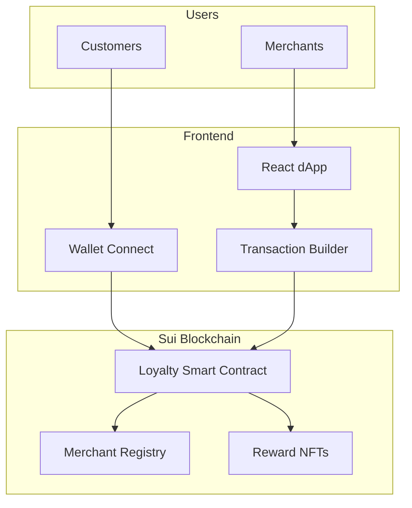

# 🎯 SuiLoyal - Decentralized Loyalty Platform

[](https://sui.io)
[](https://github.com/MystenLabs/sui/tree/main/sui-move)
[](https://www.typescriptlang.org/)
[](https://reactjs.org/)
[](LICENSE)

> A cross-merchant loyalty platform built on Sui blockchain where businesses issue verifiable loyalty points that customers truly own in their wallets. Redeem points for on-chain rewards, NFT vouchers, and exclusive perks across participating merchants.


## 🌟 Live Demo

- **Devnet Deployment**: [sui-loyal.vercel.app](https://sui-loyal.vercel.app)
- **Video Walkthrough**: [Watch Demo](demo/demo.mp4)
- **Package Explorer**: [View on Sui Explorer](https://suiexplorer.com/object/YOUR_PACKAGE_ID?network=devnet)

## ✨ Key Features

### For Customers
- 🔐 **True Ownership**: Loyalty points stored in your Sui wallet
- 🔄 **Cross-Merchant Rewards**: Use points across all participating merchants
- 🎁 **NFT Vouchers**: Redeem points for exclusive NFT rewards
- 💸 **P2P Transfers**: Send points to friends and family
- 📊 **Transparent History**: All transactions on-chain and verifiable

### For Merchants
- 🏪 **Easy Integration**: Simple SDK for POS/payment systems
- 📈 **Analytics Dashboard**: Real-time insights on customer engagement
- 🛡️ **Fraud Prevention**: Blockchain-secured point issuance
- 🤝 **Partnership Network**: Create cross-merchant promotions
- 💰 **Cost Effective**: Lower fees than traditional loyalty programs

## 🏗️ Architecture



## 🚀 Quick Start

### Prerequisites
- [Sui CLI](https://docs.sui.io/build/install) (latest version)
- [Node.js](https://nodejs.org/) (v18+)
- [pnpm](https://pnpm.io/) or npm

### 1. Clone the Repository
```bash
git clone https://github.com/yourusername/sui-loyal.git
cd sui-loyal
```

### 2. Deploy Smart Contracts
```bash
# Navigate to Move package
cd sui-packages/Loyalty

# Build the package
sui move build

# Run tests
sui move test

# Deploy to devnet
sui client publish --gas-budget 100000000

# Save the package ID and platform object ID from output
```

### 3. Setup Frontend
```bash
# Navigate to frontend
cd ../../frontend

# Install dependencies
npm install

# Copy environment template
cp .env.example .env

# Update contract addresses in .env with your deployed addresses
# VITE_PACKAGE_ID=0x...
# VITE_PLATFORM_ID=0x...

# Start development server
npm run dev
```

### 4. Connect Wallet & Test
1. Install [Sui Wallet](https://chrome.google.com/webstore/detail/sui-wallet/opcgpfmipidbgpenhmajoajpbobppdil) or [Suiet](https://suiet.app/)
2. Switch to Devnet network
3. Get test SUI from [faucet](https://discord.com/invite/sui)
4. Connect wallet in the app
5. Create loyalty account
6. Use merchant portal to issue demo points
7. Redeem rewards from marketplace

## 📁 Project Structure

```
sui-loyal/
├── 📄 README.md
├── 📄 LICENSE
├── 📦 sui-packages/
│   └── Loyalty/
│       ├── Move.toml
│       ├── sources/
│       │   ├── loyalty_system.move    # Core loyalty logic
│       │   └── tests/
│       │       └── loyalty_tests.move # Comprehensive tests
│       └── build/
├── 💻 frontend/
│   ├── package.json
│   ├── .env.example                   # Environment template
│   ├── src/
│   │   ├── App.tsx                    # Main application
│   │   ├── config.ts                  # Configuration & env vars
│   │   ├── types/                     # TypeScript definitions
│   │   ├── components/                # Reusable UI components
│   │   │   ├── Navigation.tsx
│   │   │   ├── Notification.tsx
│   │   │   ├── LoadingOverlay.tsx
│   │   │   ├── Footer.tsx
│   │   │   └── tabs/                  # Tab components
│   │   │       ├── HomeTab.tsx
│   │   │       ├── RewardsTab.tsx
│   │   │       ├── MerchantTab.tsx
│   │   │       └── ProfileTab.tsx
│   │   └── lib/
│   │       └── sui.ts                 # Sui SDK wrapper
├── 📁 scripts/
│   └── deploy.sh                      # Deployment script
├── 📁 docs/                          # Documentation
│   ├── architecture.md
│   ├── move_contract_docs.md
│   └── onboarding_guide.md
├── ⚙️  .github/
│   └── workflows/
│       └── ci.yml                     # CI/CD pipeline
└── 🔧 Configuration files
    ├── .gitignore
    ├── LICENSE
    └── README.md
```

## 🛠️ Development

### Frontend Development
```bash
cd frontend

# Install dependencies
npm install

# Start development server
npm run dev

# Run tests
npm run test

# Build for production
npm run build

# Lint code
npm run lint
```

### Smart Contract Development
```bash
cd sui-packages/Loyalty

# Build contracts
sui move build

# Run tests
sui move test

# Deploy to devnet
sui client publish --gas-budget 100000000
```

## 🧪 Testing

### Smart Contract Tests
The Move package includes comprehensive tests covering:
- Merchant registration and management
- Customer loyalty account creation
- Points issuance and redemption
- Cross-merchant transfers
- Reward template creation and redemption
- Platform statistics tracking

```bash
cd sui-packages/Loyalty
sui move test --coverage
```

### Frontend Tests
```bash
cd frontend
npm run test
```

## 📊 Features Status

- ✅ **Smart Contracts**: Fully implemented and tested
- ✅ **Frontend**: Complete UI with responsive design
- ✅ **Wallet Integration**: Ready for Sui Wallet connection
- ✅ **Demo Mode**: Working prototype with mock data
- 🚧 **Live Deployment**: Ready for devnet deployment
- 🚧 **Real Wallet Integration**: Prepared for @mysten/dapp-kit
- 🚧 **NFT Rewards**: Framework ready for implementation

## 🔧 Configuration

### Environment Variables
Copy `.env.example` to `.env` in the frontend directory:

```env
# Sui Network Configuration
VITE_SUI_NETWORK=devnet

# Contract Addresses (Update after deployment)
VITE_PACKAGE_ID=0x_YOUR_PACKAGE_ID_HERE
VITE_PLATFORM_ID=0x_YOUR_PLATFORM_ID_HERE
```

## 🚀 Deployment

### Smart Contracts
1. Ensure you have a Sui wallet configured for devnet
2. Fund your wallet with test SUI tokens
3. Run the deployment script or use manual commands

### Frontend
The frontend is ready for deployment on:
- Vercel
- Netlify
- GitHub Pages
- Any static hosting service

## 🤝 Contributing

1. Fork the repository
2. Create a feature branch (`git checkout -b feature/amazing-feature`)
3. Commit your changes (`git commit -m 'Add amazing feature'`)
4. Push to the branch (`git push origin feature/amazing-feature`)
5. Open a Pull Request

## 📝 License

This project is licensed under the MIT License - see the [LICENSE](LICENSE) file for details.

## 🔗 Links

- [Sui Documentation](https://docs.sui.io/)
- [Move Language Guide](https://github.com/MystenLabs/sui/tree/main/sui-move)
- [React Documentation](https://react.dev/)
- [Tailwind CSS](https://tailwindcss.com/)

## 📞 Support

For questions and support:
- Open an issue on GitHub
- Check the [documentation](docs/)
- Review the [architecture guide](docs/architecture.md)

---

Built with ❤️ using Sui blockchain technology